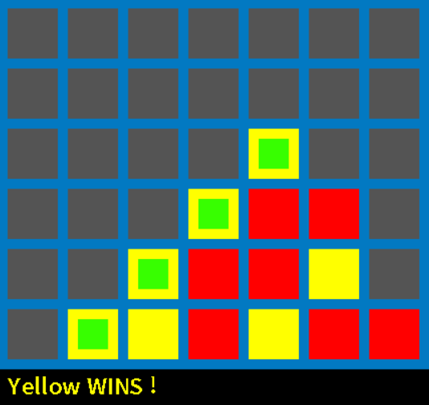

Connect four clone
==================
[](https://github.com/rmoalic/P4/actions/workflows/.ci.yml)

This project is a connect four clone made with SDL2.



Usage
-----

```bash
$ ./main    # run with default settings (7 columns, 6 rows, 4 in a row win condition)
^C

$ ./main ncol ncol nrow win_condition   # run with custom settings
^C
```
