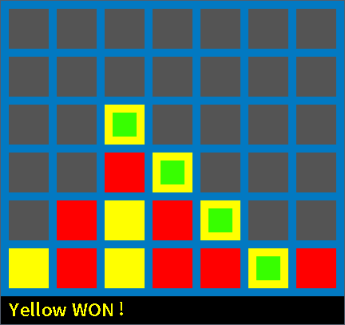

Connect four clone
==================
[](https://github.com/rmoalic/P4/actions/workflows/.ci.yml)

This project is a connect four clone made with SDL2.



Usage
-----

```bash
# run with default settings (7 columns, 6 rows, 4 in a row win condition)
$ ./main    
^C

# run with custom settings
$ ./main ncol ncol nrow win_condition
^C
```

Pre-Built Binaries
------------------

Prebuilt binaries are available in the [release tab](https://github.com/rmoalic/P4/releases).

They are build through [Github Action](https://github.com/features/actions)

Build
-----

### Linux

* Install C compiler
```
# apt install clang make
```
* Install SDL development package
```
# apt install libsdl2-dev libsdl2-ttf-dev
```
* Compile
```
$ make
```

> You will find executables in the current working folder.

### Windows

* Install MSVC
* Download SDL prebuilt packages for MSVC
```PowerShell
curl -fsSL -o SDL2-devel-VC.zip https://www.libsdl.org/release/SDL2-devel-2.0.14-VC.zip
7z x SDL2-devel-VC.zip
mv SDL2-2.0.14 SDL2
curl -fsSL -o SDL2_ttf-VC.zip https://www.libsdl.org/projects/SDL_ttf/release/SDL2_ttf-devel-2.0.15-VC.zip
7z x SDL2_ttf-VC.zip
mv SDL2_ttf-2.0.15 SDL2_ttf
```
* Start MSVC console
* Run ```build_msvc.bat``` from the MSVC console

> You will find executables in the ```out``` folder.

